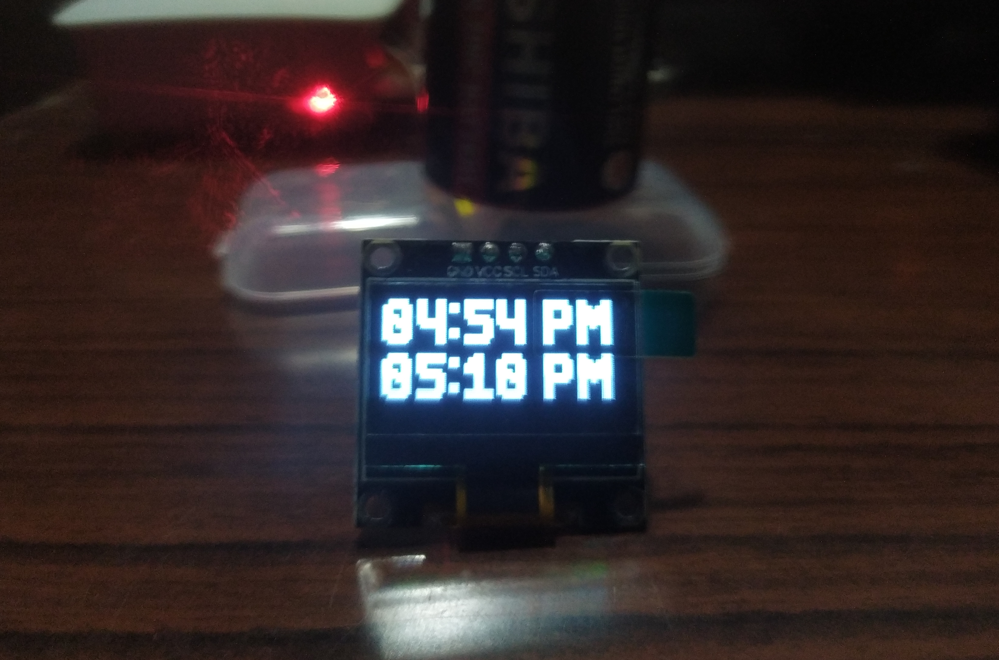
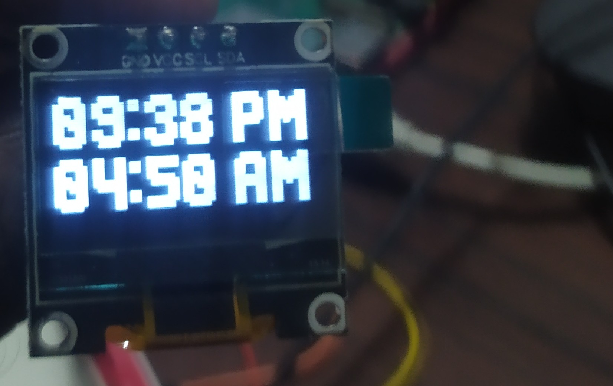

[](https://github.com/pylint-dev/pylint)
[](https://github.com/psf/black)

# Salah-Timmings
## Display Salah Timmings on small display, running on Raspberry Pi.




#### In Progress.

- [x] Make a logic to return Isha ending time (i.e. Fajir start time of next day).
- [x] Simulate a month ending and observe behavior. I reckon some errors may occur at the end of the month.
- [ ] Confirm and correct the timmings.
- [ ] 3rd info to show: Remaining time to next Salah.
- [x] Add a physical momentary button to display for 5 seconds then turn off the display (to avoid burn-in).

### Pinouts and connections:
 I have a SSD1306 display with 4 pins:

 1. VCC
 2. GND
 3. SDA
 4. SCL


>VCC -> 3V3

>GND -> GND

>SDA -> SDA

>SCL -> SCL


Check Adafruit's [website](https://learn.adafruit.com/ssd1306-oled-displays-with-raspberry-pi-and-beaglebone-black/wiring) for other displays' connections.

## Setup:

1. Load [Raspberry Pi OS](https://www.raspberrypi.com/software/) on your RPi.
2. Enter command and enable I2C or SPI from Interface options as needed:

```bash 
sudo raspi-config
``` 

3. Get XLSX timming files for your location and save them in XLSX folder.
4. Run xl2shelve.py to convert XLSX files to readable objects.
> [!IMPORTANT]
> You could get into errors if you blindly run the scripts. Read the script then modify.
5. Change index of Salahs w.r.t. to indexes of XLSX file (if needed).
6. Change main.py file as needed for your display then run:

```bash
sudo python main.py
```

> [!IMPORTANT]
> If you are getting shelve library error, try upgrading to newer Python version. I have tried on 3.11.3 & 3.11.4. You can try this [website](https://www.build-python-from-source.com/) for alternate install of Python: 


## Autostart with systemd:

1. Modify the user and ExecStart (and other if needed) in salah_timings.service file.
2. Copy this file to ```/etc/systemd/system/``` 
3. Enable the service to let it start on boot.
```
sudo systemctl enable salah_timmings.service
```

## Conclusion:

~~Unfortunately, My SSD1306 display is broken. i2cdetect is not detecting it so, I cannot work on this project further.~~

I have bought a new OLED SSD1306 display and successfully completed the project.
